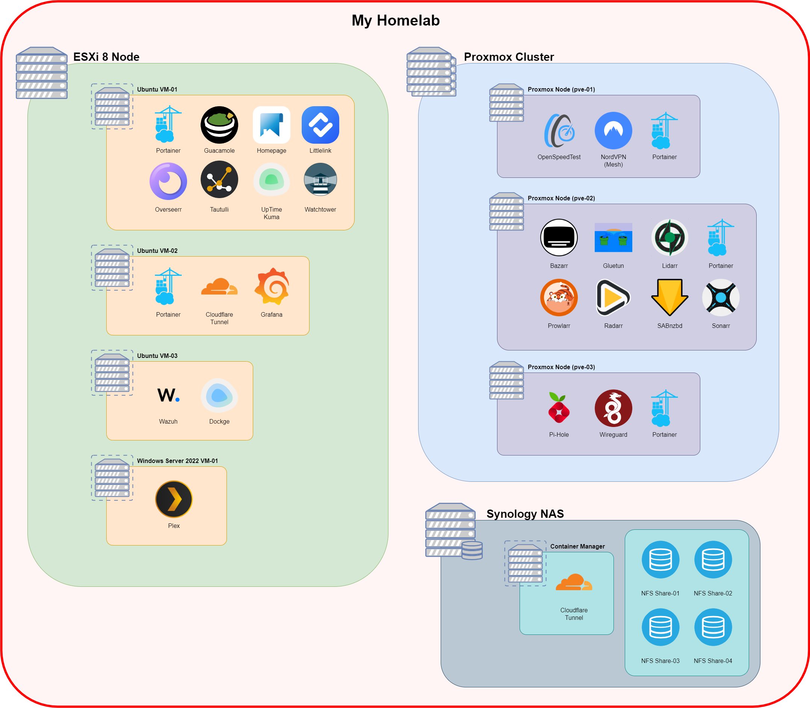

#  My Homelab 
------

##  Personal Development: 
-----

My personal and lab, network infrastructure uses exclusively Ubiquiti Unifi managed equipment with four primary servers and a Network-Attached Storage (NAS) appliance. The network architecture incorporates a firewall, a Layer 2 switch, and two Access Points (APs). It features firewall rules to separate guest, IoT devices, and DMZ traffic from the secure LAN. 

On the server side, there's a 3-node Highly Available Proxmox Cluster, complemented by a standalone ESXi 8 server. The latter serves as the primary production machine, running a Windows Server 2022 Virtual Machine (VM) alongside several Debian-based VMs. These VMs are dedicated to hosting Docker containers for a variety of workloads, including web servers, uptime monitoring, VPN, and remote desktop management. 

The Proxmox cluster, primarily used for educational purposes, hosts additional Debian-based VMs. This setup provides an excellent opportunity to explore and learn about shared storage and high availability configurations.

##  Services and Layout: 

